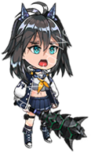

### Scrapping Images from sites



#### Avatar Character List

```
git clone https://github.com/muhimron90/assets-GDK-ove.git
Npm install

```

##### Run Puppeter

```
npm start

```

#### Images

```
Path : src/images/myImages-0.png
```

OR

Slap : [Character List](./src/images/)

#### Some Assets from GoddessKiss:OvE

```
[Folder Audio] -> Opening Sound/Title Songs
[Folder avatar-thumbnail] -> file Images
[Folder Background] -> file Images
[Folder character-sprites] -> file Images
```
